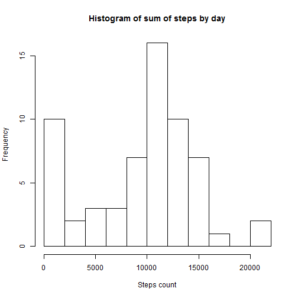
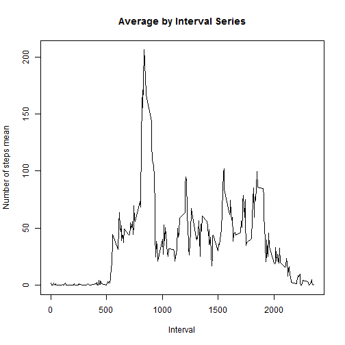
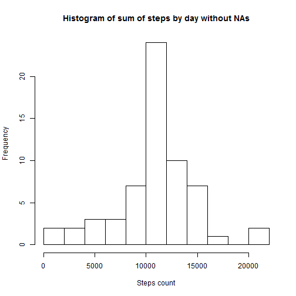
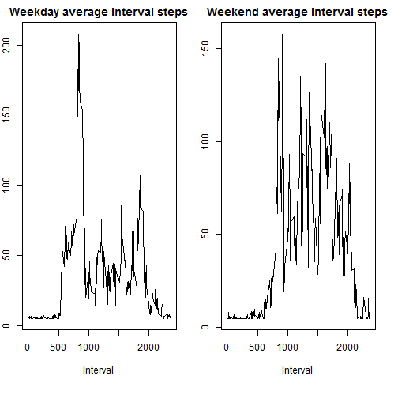

# Module 5 Project 1 

This is the output of the Module 5 Project 1.

## Scope of the project 


The purpose of the project is to answer the folowing questions related to personal movement, measured in
steps taken by an individual in a each five minute interval during the day.

Question 1: What is the mean total number of steps taken per day?

Question 2: What is the average daily activity pattern?

Question 3: What are the differences in activity patterns between weekdays and weekend?

The report must contain the following elements:

* Requirement 1: Histogram of the number of steps taken each day.
* Requirement 2: Mean and median number of steps taken each day.
* Requirement 3: Time series plot of the average number of step taken in each interval.
* Requirement 4: The 5 minute interval that, on average, contains the maximum number of steps.
* Requirement 5: Strategy for imputing missing data.
* Requirement 6: Panel plot comparing average number of steps taken for each 5 minute interval during weekdays and weekends.
* Requirement 7: Full R code to read the data and produce all the results.

All the R code is included in this document (Requirement 7).

## Required packages: dplyr and lubridate

```r
library(dplyr)
library(lubridate)
```

## Read input data

The input file (activity.csv) contains:

* steps: number of of steps taken in a 5 minute interval (NA when nota available).
* date: date in which measurement was taken.
* interval: 5 miunte interval, identified by the begining minute.

NOTE: it is assumed that the file (activity.zip) resides in the working directory. 


```r
unzipped<-unzip("activity.zip")
activity<-read.csv("./activity.csv", header = TRUE, sep = ",", quote = "\"",dec = ".", fill = TRUE)
```


##Histogram of steps by day

Blow is the histogram of total steps per day (Requirement 1).

Please note that in the preparation of this histogram the NAs in the number of steps were removed.


```r
par(mfrow=c(1,1)) # one plot on one page 
stepsByDay<-activity %>% 
  group_by( date) %>% 
  summarize( count = sum(steps, na.rm = TRUE))
hist(stepsByDay$count, breaks = 10, main="Histogram of sum of steps by day", xlab="Steps count")
```



##Mean and median of steps by day

Below are the means and medians of the number of steps per day (Requirement 2).

Please note that in the calculation of these values the NAs in the number of steps were removed.

The mean value obtained here answers Question 1.


```r
mean(stepsByDay$count)
```

```
## [1] 9354.23
```

```r
median(stepsByDay$count)
```

```
## [1] 10395
```

##Time series plot of the average of steps taken

Below is a time series plot of the average of steps taken in each interval (Requirement 3).

Please note that in the preparation of this time series plot the NAs in the number of steps were removed.

In this plot the average daily activity pattern can be observed (Question 2).


```r
averageByInterval<-activity %>% 
  group_by( interval) %>% 
  summarize( mean = mean(steps, na.rm = TRUE))
plot(averageByInterval$interval,averageByInterval$mean, 
     type="n",
     main="Average by Interval Series",
     xlab="Interval",
     ylab="Number of steps mean")
lines(averageByInterval$interval,averageByInterval$mean, type="l")
```



##5 minute interval that on average contains the maximum number of steps

Below is 5 minute interval that on average contains the maximum number of steps, represented by its stating minute.
(Requirement 4).

Please note that in the preparation of this calcualtion the NAs in the number of steps were removed.


```r
averageByInterval$interval[which.max(averageByInterval$mean)]
```

```
## [1] 835
```


##Strategy for imputing missing data

The number of observations with steps = NA is:


```r
count(dplyr::filter(activity, is.na(steps)))
```

```
## # A tibble: 1 × 1
##       n
##   <int>
## 1  2304
```

The NAs were replaced with the overall interval steps average (Requirement 5).


```r
activityWithNAReplaced<-activity
activityWithNAReplaced[is.na(activityWithNAReplaced[,1]), 1] <- mean(activityWithNAReplaced[,1], na.rm = TRUE)
```

##Histogram of steps by day with NA replaced by overall steps interval average

This is the same as requirement 1, but after applying the strategy for imputing missing values. Below is the
histogram.


```r
stepsByDayWithNAReplaced<-activityWithNAReplaced %>% 
  group_by( date) %>% 
  summarize( count = sum(steps, na.rm = TRUE))
hist(stepsByDayWithNAReplaced$count, breaks = 10, main="Histogram of sum of steps by day without NAs", xlab="Steps count")
```




##Time series plot of the average number steps taken in weekdays and weekends for each interval

Below is the time series panel plot of the average number steps taken  for each interval, containing a plot
for in weekdays, on the left, and weekends, on the right (Requirement 6). 

In this plot the differences btween average daily activity pattern in weekdays and weekends, can be observed (Question 3).


```r
par(mfrow=c(1,2))
par(mar=c(6,2,2,2))
#add isWeekend: TRUE if day is 1 or 7
activityWithNAReplacedWithWeekendInd <- mutate( activityWithNAReplaced, isWeekend = ( wday(date) == 1 | wday(date) == 7) )
#weekday plot
averageByInterval<-activityWithNAReplacedWithWeekendInd %>% 
  dplyr::filter(isWeekend==FALSE) %>%
  group_by( interval) %>% 
  summarize( mean = mean(steps, na.rm = TRUE))
plot(averageByInterval$interval,averageByInterval$mean, 
     type="n",
     main="Weekday average interval steps",
     xlab="Interval",
     ylab="Average")
lines(averageByInterval$interval,averageByInterval$mean, type="l")
#weekend plot
averageByInterval<-activityWithNAReplacedWithWeekendInd %>% 
  dplyr::filter(isWeekend==TRUE) %>%
  group_by( interval) %>% 
  summarize( mean = mean(steps, na.rm = TRUE))
plot(averageByInterval$interval,averageByInterval$mean, 
     type="n",
     main="Weekend average interval steps",
     xlab="Interval",
     ylab="Average")
lines(averageByInterval$interval,averageByInterval$mean, type="l")
```


